# β-VAE
Pytorch implmentation of the paper:
[β-VAE: Learning Basic Visual Concepts with a Constrained Variational Framework, Higgins et al., ICLR, 2017]

This repository is modified from https://github.com/1Konny/Beta-VAE with the following changes:
1. Rewrote the code with a more updated PyTorch version (1.2)
1. Replaced **visdom** with **tensorboard**
1. All datasets are written as a PyTorch Dataset class with automatic download function
1. Latent space traverse are provided as jupyter notebooks
1. Trained weights for each dataset are provided

### To Do:
1. Include the model from the paper [Understanding disentangling in β-VAE, Burgess et al.](https://arxiv.org/abs/1804.03599)

<br>

### Dependencies
```
python => 3.6
pytorch => 1.2
sacred => 0.8
```
<br>

### Datasets
There Datasets are written as PyTorch Dataset classes.

`dSprites(root, download=False)`

`Chairs(root, transform=None, download=False)`

`CelebA(root, split="train", target_type="attr", transform=None,target_transform=None, download=False)`

However, the automatic download feature for CelebA might not work due to the quote limit in Google Drive. If that happens, you need to manually download all the required files and put it in the folder specified in `root`
<br>

### Usage
#### Training
To train the model on dSprites, run `python train_on_dSprites_H.py`.

To train the model on Chair dataset in RBG color run `python train_on_chairs_H.py`; to train on only Black and White color, run `pyhont train_on_chairs_H_BW.py`

To train the model on CelebA, run `python train_on_celeba_H.py`.

Since this implmentation uses `sacred`, users can specified the condictions for training. For example `python train_on_dSprites_H with lr=1e-4 epoches=200 beta=4 warm_up=0` means that the learning rate is 1e-4, train for 200 epoches, the parameter beta equals to 4, and introduce KL-divergence right at the beginning. 

The following arguments are supported
```python
lr=5e-4             # Learning rate
epoches=200         # Number of epoches going to be trained
beta=4              # Beta factor
device=cuda:0       # What device to use
num_workers=4       # number of workers for the dataloader
image_size=64       # Downsampling for the dataset to a specific size
z_dim=10            # Latent space dimentsion
recon_type=BCE      # The reconstrcution loss that is going to be used
activation=sigmoid  # The activation function for the last layer of decoder
warm_up=0           # The epoch to introduce KL-divergence. If warm_up=0, KL-divergence and reconstruction loss are both being minimized at the very beginning. If warm_up=20, it means the KL-deivergence will only be introduced after training for 20 epoches. For 1-20 epoches, only the reconstruction loss is being minimized. 
logdir = f'runs/dSprites-BW-VAEv2_H-z_{z_dim}-{recon_type}-warm_up={warm_up}-{activation}-beat={beta}-'+ datetime.now().strftime('%y%m%d-%H%M%S')
```
#### Real-time Visualization using Tensorboard
Do `tensorboard --logdir=./runs --port=8890 --bind_all` on your terminal or your server, then access the tensorboard using your browser with the url `localhost:8890`. Here, the port number 8890 is just an example, please refer to your server configuration to see which port to use.
<br>

### Results
#### dSprites

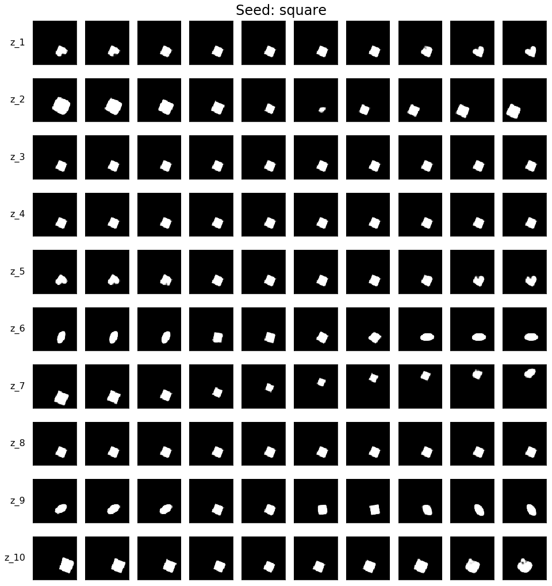

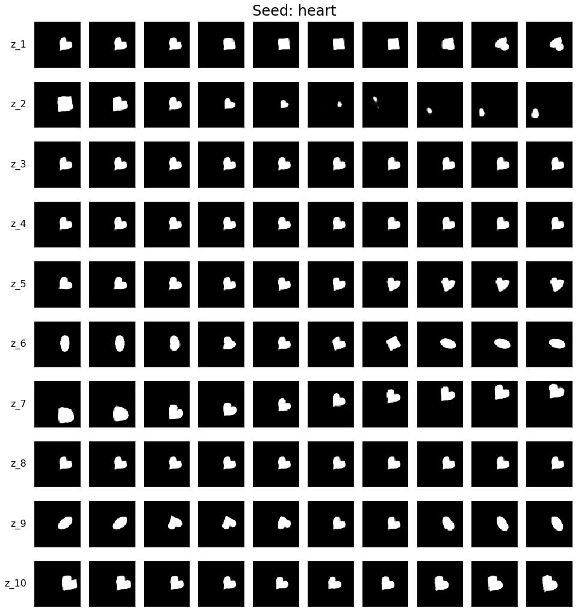

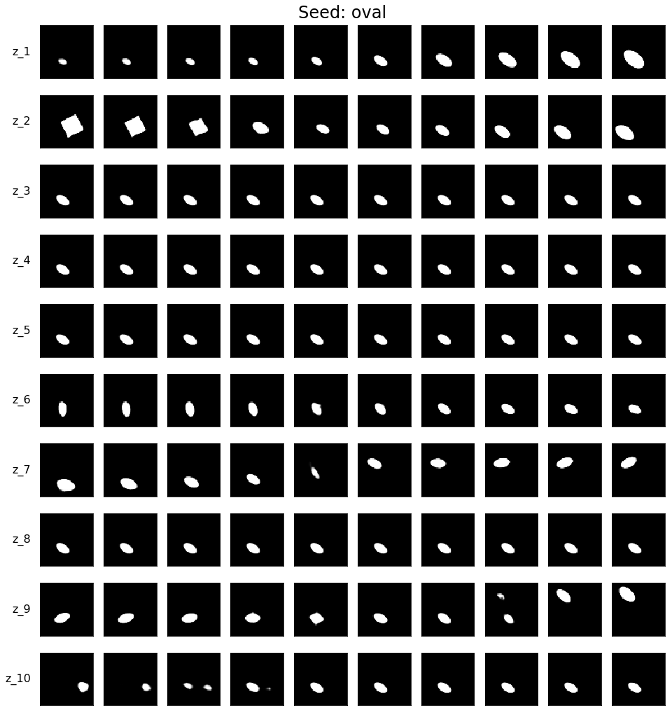

#### Chairs

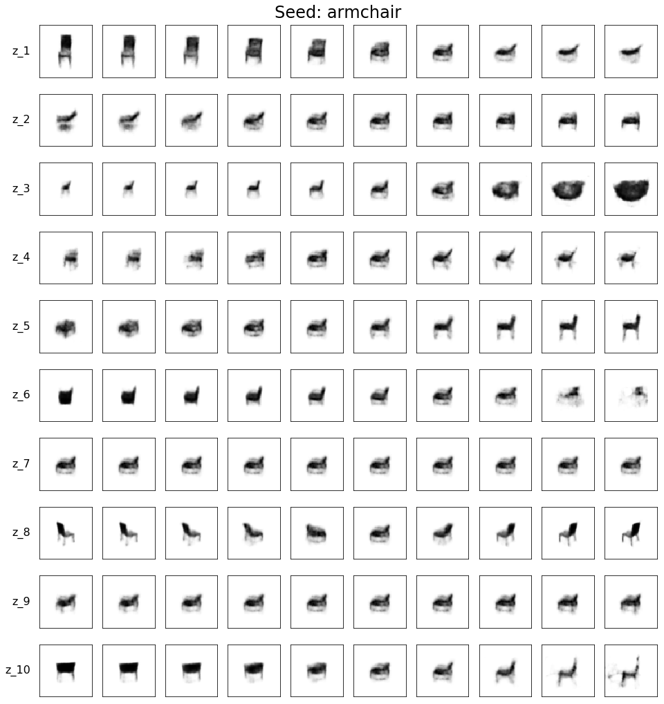

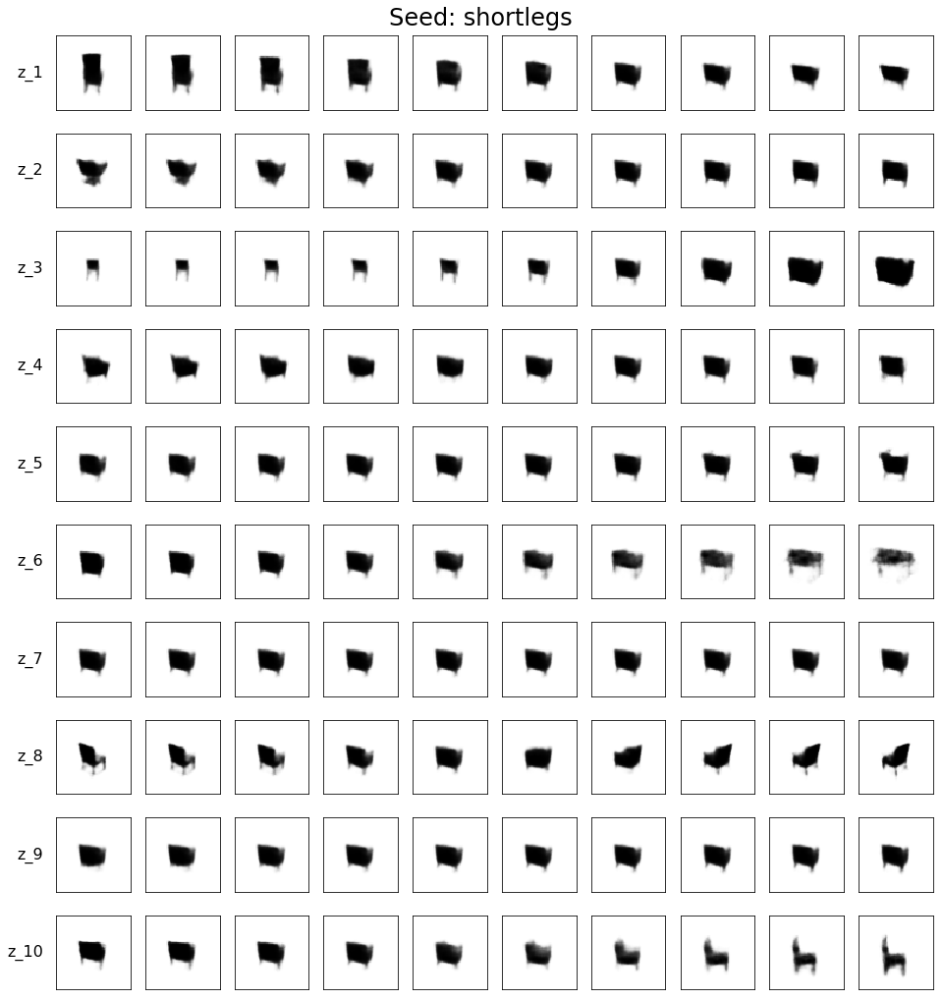

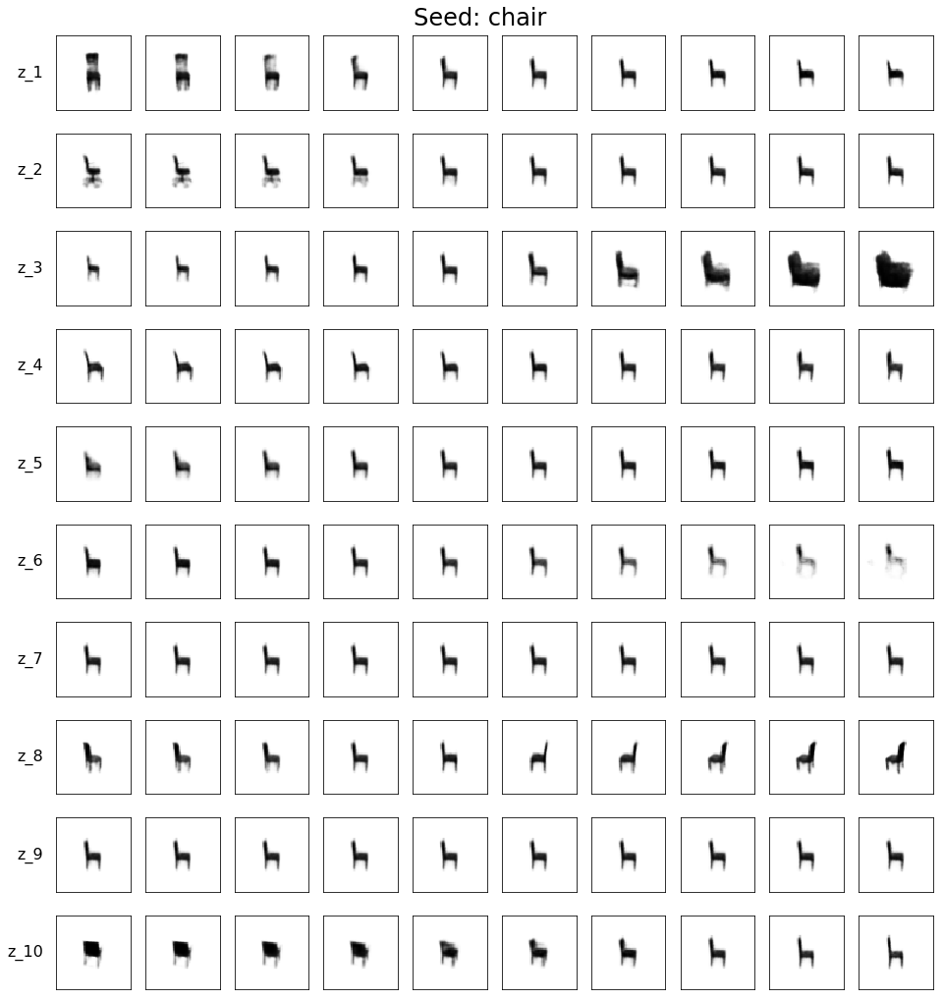

#### CelebA

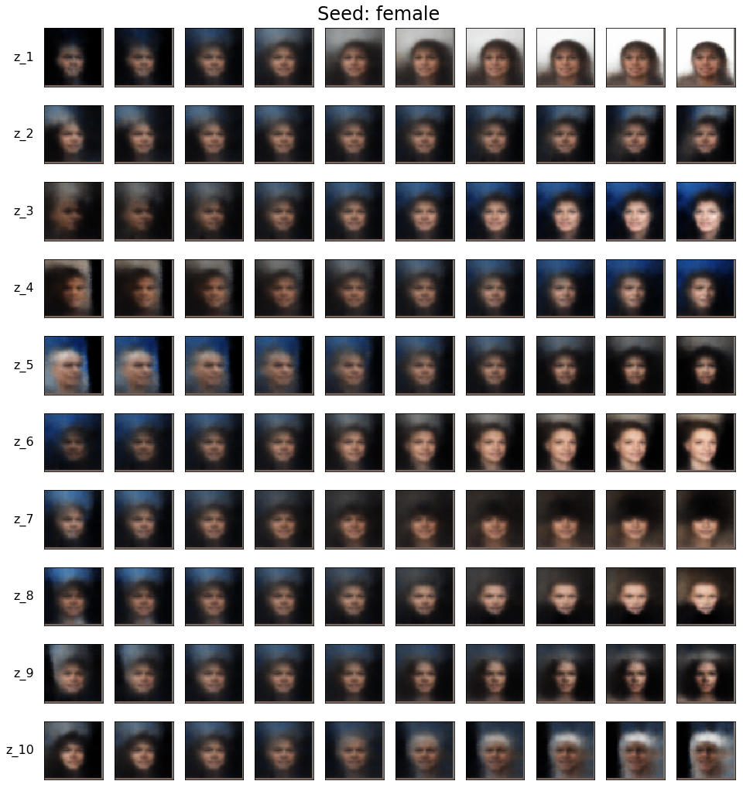

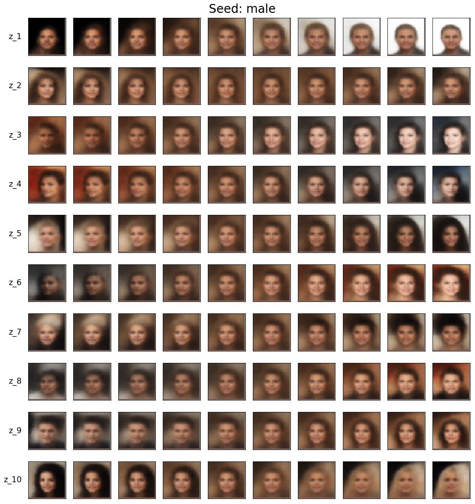

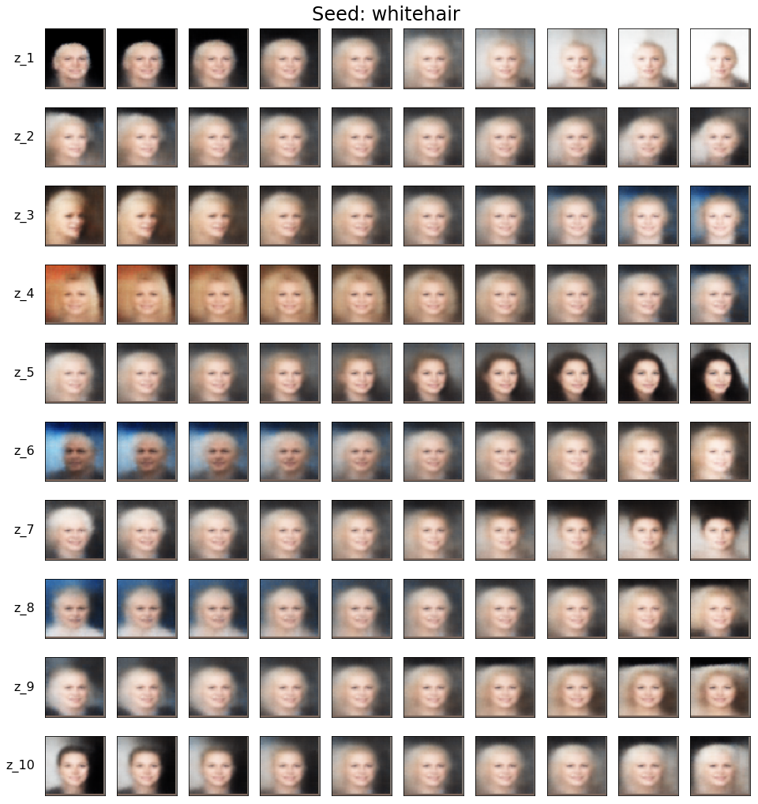

##### Tensorboard
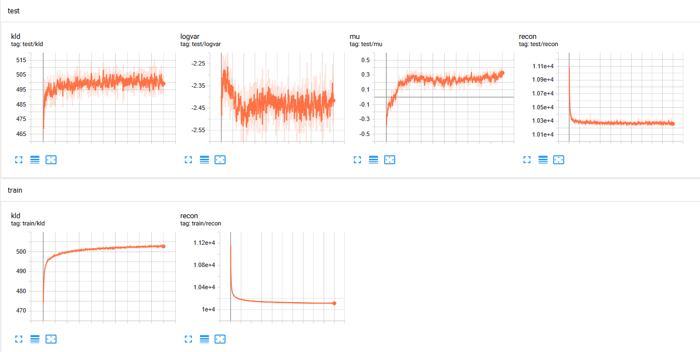

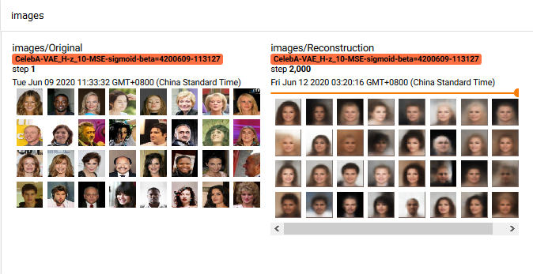

